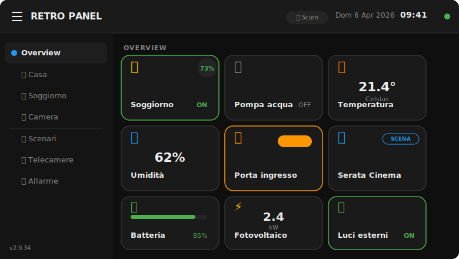
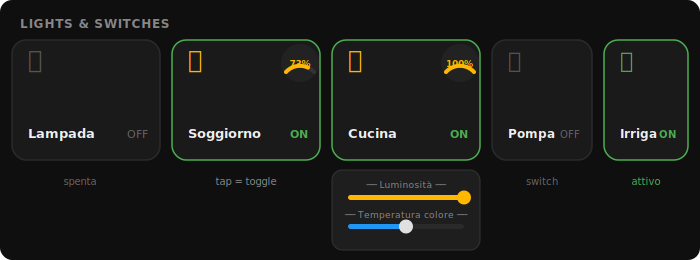
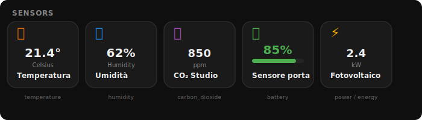
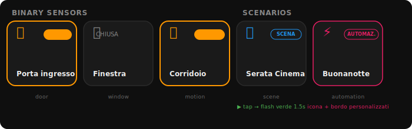
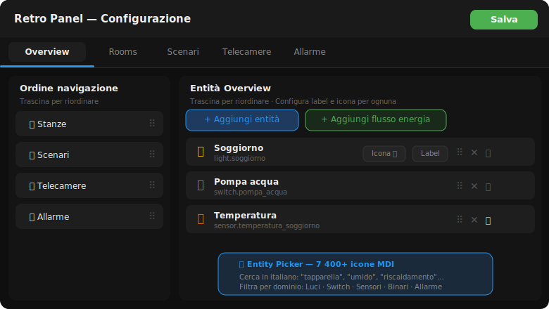

# Retro Panel — Home Assistant Add-on

[![Release][release-badge]][release-url]
[![License][license-badge]](LICENSE)
[![HA Supervisor][ha-badge]][ha-url]
[![Supports aarch64][aarch64-badge]][aarch64-url]
[![Supports amd64][amd64-badge]][amd64-url]
[![Supports armhf][armhf-badge]][armhf-url]
[![Supports armv7][armv7-badge]][armv7-url]

[release-badge]: https://img.shields.io/github/v/release/paolobets/retro-panel?style=flat-square
[release-url]: https://github.com/paolobets/retro-panel/releases
[license-badge]: https://img.shields.io/github/license/paolobets/retro-panel?style=flat-square
[ha-badge]: https://img.shields.io/badge/Home%20Assistant-2023.1%2B-blue?style=flat-square
[ha-url]: https://www.home-assistant.io/
[aarch64-badge]: https://img.shields.io/badge/aarch64-yes-green?style=flat-square
[amd64-badge]: https://img.shields.io/badge/amd64-yes-green?style=flat-square
[armhf-badge]: https://img.shields.io/badge/armhf-yes-green?style=flat-square
[armv7-badge]: https://img.shields.io/badge/armv7-yes-green?style=flat-square
[aarch64-url]: https://github.com/paolobets/retro-panel
[amd64-url]: https://github.com/paolobets/retro-panel
[armhf-url]: https://github.com/paolobets/retro-panel
[armv7-url]: https://github.com/paolobets/retro-panel

---

> **A touch-optimized, kiosk-ready Home Assistant dashboard built for iOS 12+,
> old Android tablets, and resource-constrained devices.**
> Real-time updates via WebSocket. Zero build dependencies. Works where Lovelace doesn't.

Give a second life to that old iPad, Fire tablet, or wall-mounted Android that struggles
with the standard Home Assistant interface. Retro Panel is a lightweight always-on control
panel designed from the ground up for **legacy browsers and older hardware** — no transpilation,
no frameworks, no `const`, no arrow functions.

---

## Dashboard



The panel is split into a collapsible **sidebar** (navigation sections) and a **content area**
with a fixed-height tile grid. A live **clock**, connection **status dot** and **theme toggle**
sit in the header. Everything works at 120 px tile height with no layout shift.

---

## Lights & Switches



| Action | Result |
|--------|--------|
| Tap light | Toggle on/off (optimistic, immediate feedback) |
| Long-press light (500 ms) | Bottom sheet: brightness · colour temperature · hue |
| Tap switch / input_boolean | Toggle on/off |

---

## Sensors



Read-only tiles that display the current value and unit. Icon and visual style adapt
automatically to the device class: `temperature` · `humidity` · `co2` · `battery` ·
`power` · `energy` · `pressure` · `illuminance` · and any generic sensor.

---

## Binary sensors & Scenarios



**Binary sensors** show a state-driven icon (open/closed, detected/clear, armed/ok…).
An **orange pulsing border** signals an active alert.

**Scenario tiles** (scene · script · automation) trigger with a single tap.
Each tile shows a **domain badge**, a configurable **MDI icon** and an optional **border colour**.

---

## Configuration UI



Access the admin panel at `http://[HA-IP]:7654/config`. Five tabs cover everything:

| Tab | What you configure |
|-----|--------------------|
| **Overview** | Main home screen entities · Power flow card · Navigation order |
| **Rooms** | Rooms with sections · Import from HA Areas · Per-entity icon and label |
| **Scenarios** | Scene/script/automation groups · MDI icon per item · Border colour per item |
| **Cameras** | Camera feeds · Per-camera refresh interval · Hide/show |
| **Alarms** | Alarm panels · Zone sensors per panel |

The icon picker includes **7 400+ MDI icons** with Italian-language search
("tapparella", "umido", "riscaldamento"…).

---

## Energy flow card

Live power-flow visualisation mapping up to 7 sensor entities:

```
  ☀ Solare     🔋 Batteria (85%)     🏠 Casa
  2.4 kW  ──→──  +0.8 kW  ──────→──  1.6 kW
                     │  ↑↓
                 ⚡ Rete  0.0 kW
```

Animated arrows reflect live energy direction. Tested with ZCS Azzurro · SMA · Fronius · Huawei SUN2000.

---

## All supported entity types

| Entity | Layout type | What you can do |
|--------|-------------|-----------------|
| `light` | `light` | Toggle · brightness · colour temperature · hue |
| `switch` · `input_boolean` | `switch` | Toggle on/off |
| `sensor` (various device classes) | `sensor_*` | Read-only value + unit |
| `binary_sensor` (door/window/motion/smoke/lock…) | `binary_*` | State display + alert pulse |
| `cover` | `cover_standard` | Toggle open/close · position bar |
| `alarm_control_panel` | `alarm` | PIN keypad · Arm Home/Away/Night · zone sensors |
| `camera` | `camera` | MJPEG live stream · snapshot fallback · lightbox |
| `scene` · `script` · `automation` | `scenario` | Tap-to-activate · custom icon/colour |
| _(virtual)_ | `energy_flow` | Solar/battery/grid/home power card |
| _(virtual)_ | `sensor_conditional` | Conditional state card (AND/OR logic) |

---

## Alarm panel

```
  DISARMATO — scegli modalità          ARMATO FUORI
  ┌──────────────────────────┐         ┌────────────────────────┐
  │ Allarme Casa             │         │ Allarme Casa           │
  │ DISARMATO                │         │ ARMATO — Fuori         │
  │                          │         │                        │
  │ [Casa]  [Fuori]  [Notte] │         │      [ Disarma ]       │
  │                          │         │                        │
  │  1   2   3               │         │  ● Porta ingresso      │
  │  4   5   6  [ Arma ]     │         │  ○ Finestra soggiorno  │
  └──────────────────────────┘         └────────────────────────┘
```

PIN keypad appears only when required. Zone sensors are listed per panel.
The PIN is never stored — sent to HA and cleared immediately.

---

## Camera grid & lightbox

Cameras are displayed in a responsive grid. Tap any camera to open a full-screen
MJPEG lightbox. Snapshot polling is used as automatic fallback when MJPEG is unavailable.
Each camera has a configurable per-item refresh interval.

---

## Installation

### Add this repository to Home Assistant

**Settings → Add-ons → Add-on Store → ⋮ (top right) → Repositories**

```
https://github.com/paolobets/retro-panel
```

Refresh the store, find **Retro Panel**, click **Install**.

### Configure

Go to the **Configuration** tab and fill in:

| Option | Description | Default |
|--------|-------------|---------|
| `ha_url` | HA instance URL | `http://homeassistant:8123` |
| `ha_token` | Long-Lived Access Token _(leave empty on HA OS/Supervised)_ | auto |
| `panel_title` | Title shown in the header | `Home` |
| `theme` | `dark` · `light` · `auto` | `dark` |
| `refresh_interval` | REST fallback poll in seconds (5–300) | `30` |

### Start

Click **Start**, then **Open Web UI**. The dashboard is at `/`, the admin at `/config`.

---

## iOS kiosk setup

1. Open **Safari** → `http://[HA-IP]:7654`
2. **Share → Add to Home Screen → Add**
3. Open the icon → full-screen, no browser chrome

**Hide the HA sidebar** using [kiosk-mode](https://github.com/NemesisRE/kiosk-mode) (HACS):

```yaml
kiosk_mode:
  hide_sidebar: '[[[ location.href.includes("hassio/ingress") ]]]'
  hide_header:  '[[[ location.href.includes("hassio/ingress") ]]]'
```

---

## Security

| Layer | Mechanism |
|-------|-----------|
| Network | Cloudflare Tunnel or WireGuard VPN (avoid direct port forwarding) |
| Authentication | HA Ingress — requires a valid HA session |
| Token isolation | Long-Lived Access Token stored server-side, never sent to the browser |
| Service whitelist | All service calls validated against a hard-coded allowlist |
| Rate limiting | Brute-force protection on alarm PIN and config endpoints |

Use a **dedicated, non-admin** HA account for the kiosk tablet.
Enable **2FA** on all administrator accounts.

---

## Requirements

| | Minimum |
|-|---------|
| Home Assistant | 2023.1 (OS or Supervised) |
| Architecture | aarch64 · amd64 · armhf · armv7 |
| Browser | iOS 12+ Safari · Chrome 70+ · Firefox 65+ · Android WebView |
| Host RAM | ~50 MB RSS (Raspberry Pi 3B+ compatible) |

---

## Documentation

| Document | Contents |
|----------|----------|
| [`retro-panel/DOCS.md`](retro-panel/DOCS.md) | User guide: entity reference, alarm, light controls, troubleshooting |
| [`retro-panel/docs/INSTALLATION.md`](retro-panel/docs/INSTALLATION.md) | Detailed install guide: SSH, Samba, Ingress, kiosk setup |
| [`retro-panel/docs/ARCHITECTURE.md`](retro-panel/docs/ARCHITECTURE.md) | System design, data flow, security model, browser compatibility |
| [`retro-panel/docs/API.md`](retro-panel/docs/API.md) | Backend REST endpoints and WebSocket protocol |
| [`retro-panel/docs/DEVELOPMENT.md`](retro-panel/docs/DEVELOPMENT.md) | Developer guide: local setup, adding entity types, iOS 12 rules |
| [`retro-panel/docs/TESTING.md`](retro-panel/docs/TESTING.md) | Test procedures and security tests |
| [`retro-panel/CHANGELOG.md`](retro-panel/CHANGELOG.md) | Full version history |
| [`retro-panel/docs/ROADMAP.md`](retro-panel/docs/ROADMAP.md) | Planned features and release schedule |

---

## Roadmap

| Version | Status | Highlights |
|---------|--------|------------|
| **v2.0** | Released | Full refactor · layout_type system · two-URL architecture |
| **v2.9** | Released | Energy card · camera grid/lightbox · alarm redesign · security hardening |
| **v2.9.20** | Released | Per-device theme toggle (dark/light/auto) |
| **v2.9.26** | Released | MDI icon picker (7 400+ icons) with Italian-language search |
| **v2.9.28** | Released | Conditional sensor tile with AND/OR logic |
| **v2.9.32** | Released | Scenario tile redesign: MDI icons, domain badge, colour border |
| **v2.9.34** | **Current** | Per-item icon + colour picker for scenarios in `/config` |
| **v3.0** | Planned | Plugin system · custom themes · history charts · offline-first |

---

## License

MIT — see [LICENSE](LICENSE)
