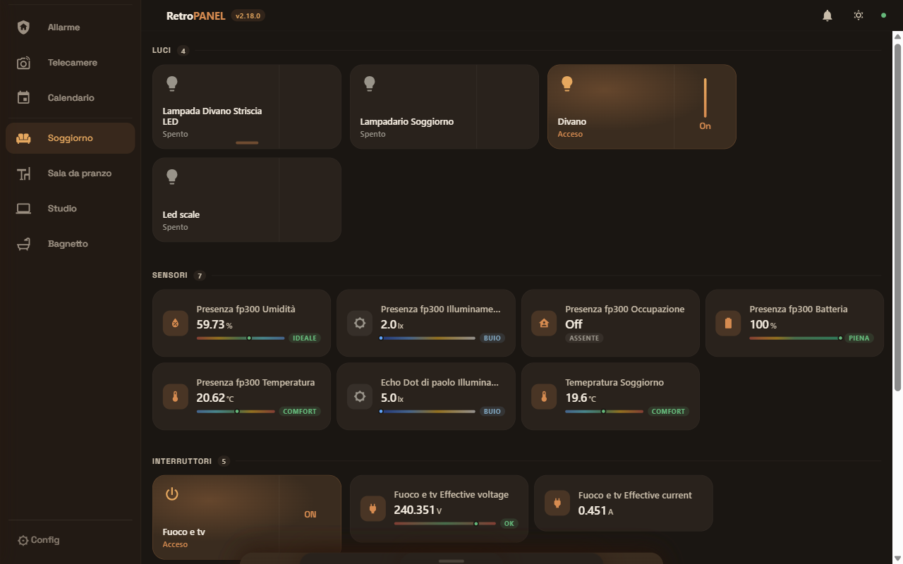
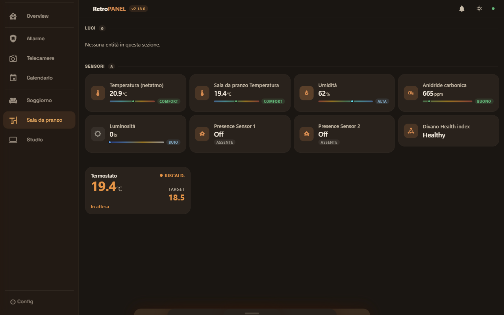
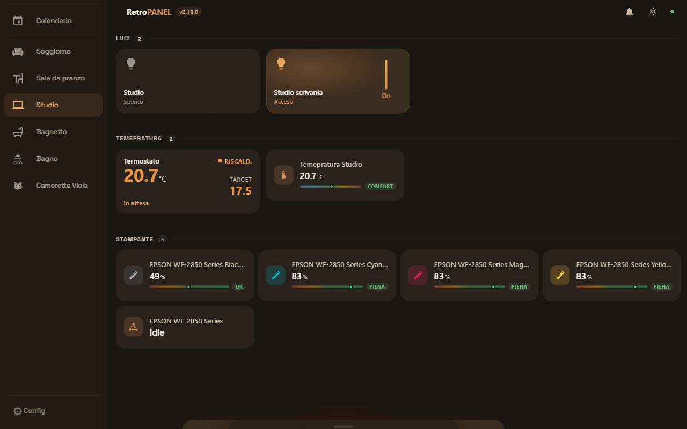
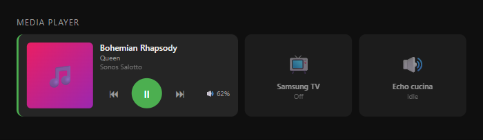
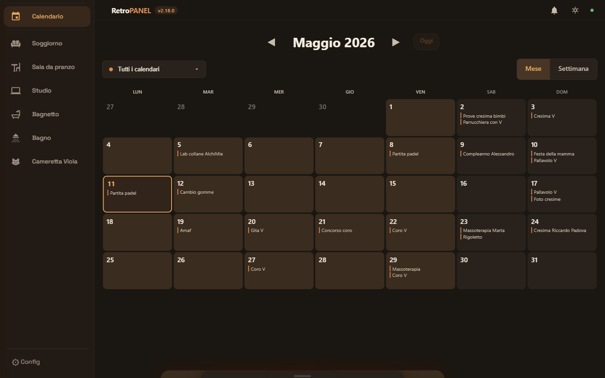
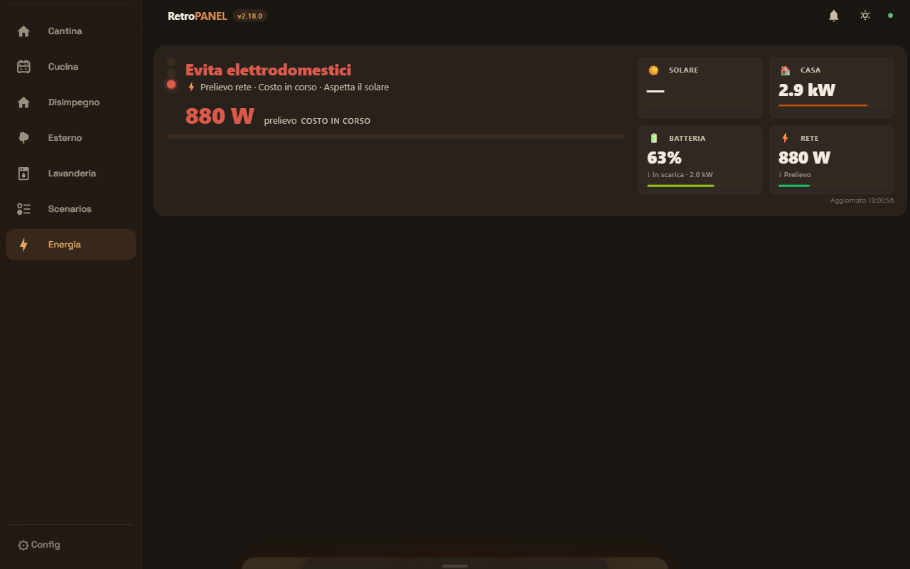
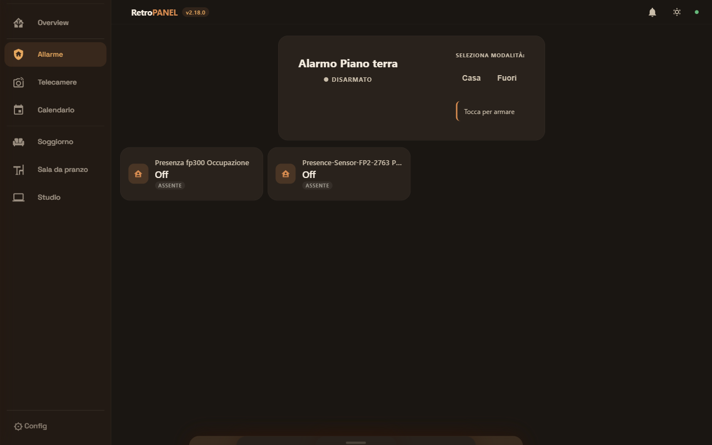
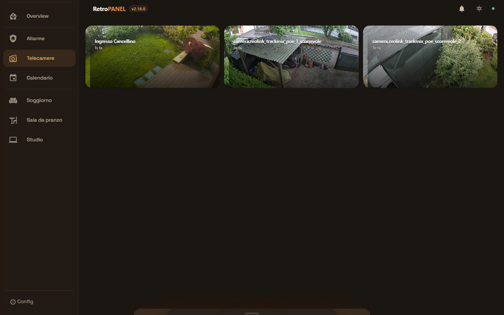
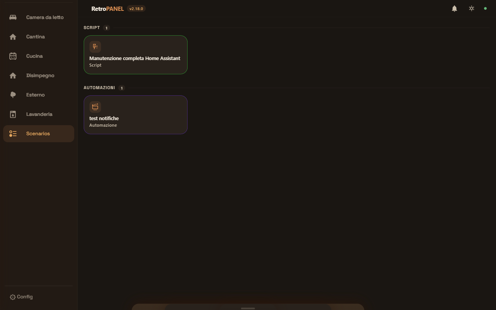
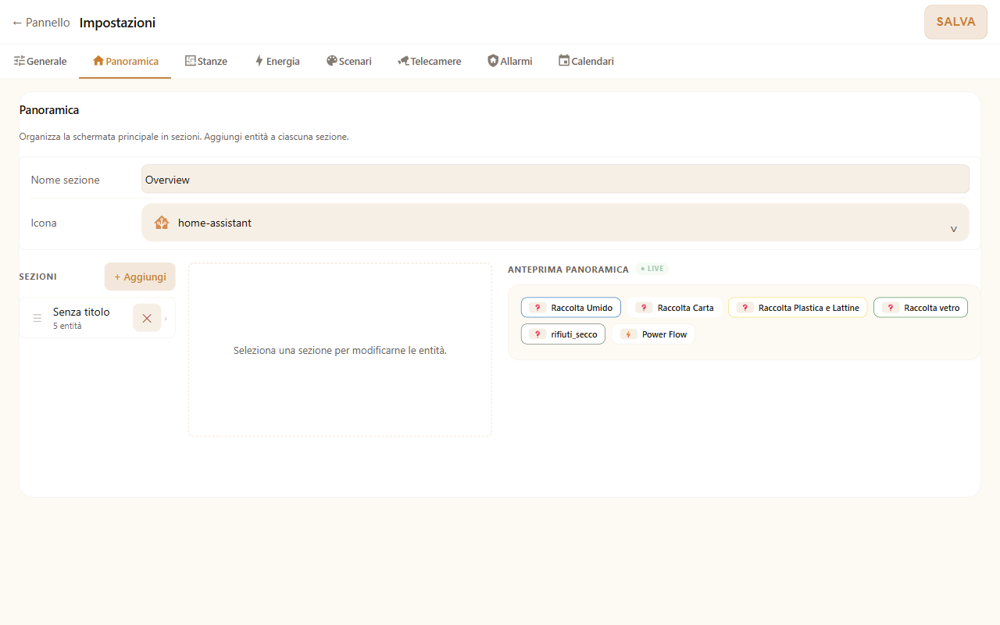

# Retro Panel

[![Release][release-badge]][release-url]
[![License][license-badge]][license-url]
[![HA Supervisor][ha-badge]][ha-url]
[![Supports aarch64][aarch64-badge]][aarch64-url]
[![Supports amd64][amd64-badge]][amd64-url]
[![Supports armhf][armhf-badge]][armhf-url]
[![Supports armv7][armv7-badge]][armv7-url]
[![Ko-fi][kofi-badge]][kofi-url]

[release-badge]: https://img.shields.io/github/v/release/paolobets/retro-panel?style=flat-square
[release-url]: https://github.com/paolobets/retro-panel/releases
[license-badge]: https://img.shields.io/badge/license-Source%20Available-blue?style=flat-square
[license-url]: https://github.com/paolobets/retro-panel/blob/master/LICENSE
[ha-badge]: https://img.shields.io/badge/Home%20Assistant-2023.1%2B-blue?style=flat-square
[ha-url]: https://www.home-assistant.io/
[aarch64-badge]: https://img.shields.io/badge/aarch64-yes-green?style=flat-square
[amd64-badge]: https://img.shields.io/badge/amd64-yes-green?style=flat-square
[armhf-badge]: https://img.shields.io/badge/armhf-yes-green?style=flat-square
[armv7-badge]: https://img.shields.io/badge/armv7-yes-green?style=flat-square
[aarch64-url]: https://github.com/paolobets/retro-panel
[amd64-url]: https://github.com/paolobets/retro-panel
[armhf-url]: https://github.com/paolobets/retro-panel
[armv7-url]: https://github.com/paolobets/retro-panel
[kofi-badge]: https://img.shields.io/badge/Ko--fi-Buy%20me%20a%20beer%20%F0%9F%8D%BA-FF5E5B?style=flat-square&logo=ko-fi&logoColor=white
[kofi-url]: https://ko-fi.com/M4M11XX4MS

**🇬🇧 English** · [🇮🇹 Italiano](README.it.md)

---

> **Transform that tablet nobody uses anymore into your home control panel.**
> A touch-first dashboard for Home Assistant designed for old iPad, Fire and Android —
> where the official Lovelace slows down or crashes, Retro Panel flies.

<p align="center">
  
</p>

---

## What's new in 2.18

- **Design System v3** — warm-tinted OKLCH palette (dark + light themes), mobile sidebar (64→200 px), bottom-right toast notifications
- **Energy Cards v2** — top-level Energy tab with traffic-light semaphore (STOP/CAUTION/GO/IDLE), hero card + 2×2 metrics grid, dedicated `energy_cards[]` schema
- **Valve tile** — new entity type for water valves and irrigation systems, binary open/closed state with manual-start bottom-sheet
- **HIRIS integration** — embed an external AI chat add-on directly in the dashboard (compact tile + full-screen overlay)
- **New sensor types** — `sensor_noise` (5-pill 30-90 dB scale), `sensor_cartridge` (CMYK printer ink, auto-detected from entity_id patterns)
- **Security CR-1** — X-Ingress-Path spoofing fix (CIDR validation, `ingress_supervisor_cidr` option)
- **+10 audit fixes** (XSS in icon picker, async race conditions, dark-mode token cycle, iOS 12 hardening, sensor dispatch coverage)
- **aiohttp upgraded** to 3.10.11 (CVE-2024-52304 + CVE-2024-42367)

> Full changelog: [v2.18.0 Release](https://github.com/paolobets/retro-panel/releases/tag/v2.18.0)

---

## Why you'll love it

🎯 **One screen, your entire home** — lights, blinds, climate, energy, security, media, calendar, cameras, and now AI chat with HIRIS too — all at your fingertips.

📱 **Works on that old tablet** — iPad iOS 12, Fire HD from 2018, Android 7… if it has a browser, it works. No need to upgrade to something "newer".

⚡ **Instant updates** — flip a switch in the kitchen, the dashboard in the living room changes in real-time. Native WebSocket to Home Assistant.

🎨 **True touch-first** — 44 px buttons, natural gestures, bottom sheets that don't fight with mobile keyboards. No hidden menus, no surgical-precision taps.

🔒 **Secure by design** — Home Assistant tokens never exposed to the browser, service whitelist, rate limiting on alarm PIN. Designed to stay on the wall 24/7.

---

## Your home at a glance

The panel is split in two:

- **Sidebar** on the left (collapsible) to jump between rooms
- **Tile grid** on the right showing what's happening *right now*

At the top: clock, connection indicator, and theme toggle (light/dark/automatic by time of day).

All tiles are **the same height** (120 px). When a media player starts, its tile doubles in width to fit cover art and controls — the rest of the grid reflows smoothly.

---

## What you can control

### 💡 Lights & switches

<table><tr><td>

```
┌──────────────────────┐   ┌──────────────────────┐
│  💡 Living Room      │   │  💡 Kitchen          │
│  On                  │   │  Off                 │
│           ▓▓▓▓▓▓░░░  │   │                      │
│           65%        │   │                      │
└──────────────────────┘   └──────────────────────┘
```

</td></tr></table>

| Gesture | Result |
|---------|--------|
| **Tap** | Toggle on/off (immediate optimistic feedback) |
| **Long-press 500 ms** | Bottom sheet: brightness, color temperature, hue |

For switches and `input_boolean`: tap only, no long-press.

### 📊 Sensors

<p align="center">
  
</p>

<p align="center">
  
</p>

The tile changes *appearance* based on sensor type. Nothing to configure — it figures it out from the `device_class`.

| Category | What you see |
|----------|--------------|
| 🌡 **Temperature · Humidity · CO₂** | Colored bubble that turns red/orange/green based on thresholds |
| 🔋 **Battery · Energy · Power** | Dynamic icon + value with unit (W, kWh, %) |
| 📈 **Progress (%)** | Horizontal bar in 4 levels — great for printer cartridges, NAS RAM, storage fill |
| 📊 **Noise (dB)** | Horizontal 5-pill scale (Silent/Low/Normal/Loud/Very loud) |
| 🖨️ **Printer cartridge** | Colored bubbles CMYK with 5 fill levels (Empty/Critical/Low/OK/Full) — auto-detected from entity_id |
| 📋 **Discrete state** | Washing machine "Spinning", dryer "Drying"… the text you expect |
| 🕐 **Date and time** | Friendly relative time — "3 min ago", "today 4:30 PM", "yesterday" |
| ⚠️ **Binary sensors** | Door open? Motion? Smoke? Pulsing border, dedicated icon |

### 🎵 Media player

<p align="center">
  
</p>

Full remote control for Echo, Sonos, HomePod, Apple TV, Samsung TV, and any Home Assistant `media_player`.

| State | Tile |
|-------|------|
| 🎶 **Playing / Paused** | Wide tile (2 columns): cover art · title · artist · transport · volume |
| 💤 **Idle / Off** | Compact tile (1 column): device icon · name · status |

Tap the wide tile to open the **bottom sheet** with: volume slider, source selector, sound mode, shuffle/repeat and speaker grouping. The controls shown adapt to the capabilities declared by the media player.

### 📅 Calendar

<p align="center">
  
</p>

**Month** or **week** view, with multi-calendar dropdown to show/hide different sources (Google, iCloud, work…).

Tap an event → **side panel** opens with time, location (📍), description and source calendar.

### ⚡ Energy flow

<p align="center">
  
</p>

**Energy Cards v2** (redesigned in 2.18): a dedicated top-level Energy tab in the sidebar. The hero **Power Flow** card shows a **traffic-light semaphore** with five states:

| State | Meaning | Trigger |
|-------|---------|---------|
| 🔴 **STOP** | Avoid appliances — grid draw in progress | grid draw >30 W |
| 🟡 **CAUTION** | Battery discharging — limit consumption | battery discharge >30 W |
| 🟡 **CAUTION_SOLAR** | Solar covers base load but not enough for heavy consumption | solar >30 W AND ≤ home+30 W |
| 🟢 **GO** | Surplus available — start dishwasher, charge EV, etc. | surplus >30 W |
| ⚪ **IDLE** | No significant flow | all sources <30 W |

The card is split into a **hero on the left** (semaphore + status text + main metric + progress bar) and a **2×2 metrics grid on the right** (Solar / Home / Battery / Grid with SOC and direction arrows). A timestamp ("Updated HH:MM:SS") sits in the bottom-right. The layout is fully responsive — hero + grid stack on portrait ≤768 px.

The Energy tab also hosts additional configurable cards: chip metrics, battery status, solar production widgets. Each card carries an explicit `card_id` placement marker so reordering doesn't lose state.

Tested with **ZCS Azzurro**, **SMA**, **Fronius**, **Huawei SUN2000**.

### 🚨 Burglar alarm

<p align="center">
  
</p>

```
  DISARMED — choose mode              ARMED AWAY
  ┌──────────────────────────┐         ┌────────────────────────┐
  │ Home Alarm               │         │ Home Alarm             │
  │ DISARMED                 │         │ ARMED — Away           │
  │                          │         │                        │
  │ [Home] [Away] [Night]    │         │      [ Disarm ]        │
  │                          │         │                        │
  │  1   2   3               │         │  ● Front door          │
  │  4   5   6  [ Arm ]      │         │  ○ Living room window  │
  └──────────────────────────┘         └────────────────────────┘
```

Three quick buttons: **Home**, **Away**, **Night**. The PIN keypad appears *only if your `alarm_control_panel` requires it*. When armed, you see zone sensors with live status.

The PIN is never stored — it's sent to Home Assistant and erased from memory immediately.

### 📷 Cameras

<p align="center">
  
</p>

4-column grid with live preview. Tap a camera → **full-screen lightbox**:

- **MJPEG** ultra-low-latency where available (PTZ control ~1-2 s)
- **HLS** for long streaming (fMP4 supported)
- **Snapshot polling** automatic fallback if MJPEG doesn't respond
- **PTZ control** built-in with D-pad and zoom bar for supported cameras

### 🪟 Blinds & curtains

```
┌─────────────────────────────┐
│  🪟 Kitchen Blind            │
│  Open at 70%                │
│  ▓▓▓▓▓▓▓░░░                 │
│  [▲]  [■]  [▼]              │
└─────────────────────────────┘
```

Three buttons (open/stop/close) + current position bar. Animation active while the blind is moving.

### 🌡️ Thermostat

Current temperature large, target small below. Tap opens a bottom sheet with temperature slider, HVAC mode choice (heat/cool/auto/off) and fan speed when supported.

### 🔐 Smart locks

SVG padlock that visually opens/closes. Status always visible.

### 🚰 Valves

**New in 2.18.** Touch-friendly control for water valves and irrigation systems.

| State | Tile | Action |
|-------|------|--------|
| **Closed** | Compact tile · icon · "Closed" label | Tap to open bottom-sheet |
| **Open** | Compact tile · warm-tint accent · "Open" + countdown if timed | Tap for bottom-sheet · long-press for instant close |

The **valve bottom-sheet** exposes a manual-start button (`▶ Start`) and explicit `Close` action. For valves supporting timed cycles (irrigation), the countdown mirrors on the tile while the cycle is active. Works on `valve.*`, `switch.*`-pretending-to-be-valves (via custom `layout_type` override), and `input_boolean.*` (manual valves).

ES5 strict, iOS 12 safe — no slider gestures, no animations that fail on legacy WebKit.

### 🎯 Buttons & scenes

Tap → confirmation with green flash. For scenes/scripts/automations: badge showing what it is, customizable MDI icon, colored border for visual organization.

### 🤖 AI Chat (HIRIS)

<table><tr><td>

```
┌────────────────────────────────────────┐
│ ╭────╮  Home Assistant            ›   │
│ │ 🌸 │  Open chat ›                    │
│ ╰────╯                                 │
└────────────────────────────────────────┘
```

</td></tr></table>

A **compact card** on the dashboard. Tap → full-screen chat opens:

```
┌────────────────────────────────────┐
│ 🌸 Home Assistant             ✕  │
├────────────────────────────────────┤
│                                    │
│         "Turn on the lights"  ╮    │
│              in the kitchen  │    │
│                                    │
│ 🌸  ╭ Done, I turned on 3 lights │
│     ╰ in the kitchen.              │
│                                    │
│         "How much power?"    ╮     │
│                                    │
│ 🌸  ╭ • • •                        │
│     ╰  (thinking…)                 │
│                                    │
├────────────────────────────────────┤
│ ┌──────────────────────────┐  ╭─╮ │
│ │ Type a message…          │  │↗│ │
│ └──────────────────────────┘  ╰─╯ │
└────────────────────────────────────┘
```

Works with the companion **HIRIS** add-on (see below):

- 💬 **Natural conversation** — "turn off the living room", "what's the temperature in the bedroom?", "play relaxing music"
- 🌸 **HIRIS avatar** next to every response — you always know who you're talking to
- 🌊 **"Wave" indicator** while the AI thinks (3 animated purple dots)
- ⌨️ **Mobile keyboard handling** — on iOS 12 the overlay resizes when the keyboard appears, input never gets covered
- ↩️ **ESC desktop / back hardware Android** close the overlay without losing the conversation

The authentication token for HIRIS stays server-side, never exposed to the browser.

> **To use it:** install the [HIRIS](https://github.com/paolobets/hiris) add-on (also free), configure an agent, then add a `hiris_chat` tile to a panel section from the configuration page.

### 🎬 Scripts & automations

<p align="center">
  
</p>

Bundle scenes, scripts, and automations into a dedicated **Scenarios** sidebar entry. Each item shows:

- Custom MDI icon (from 7,400+ in the picker)
- Domain badge (Script / Scene / Automation)
- Border color per item (optional — for grouping by purpose)
- One tap = run · long-press = open HA more-info panel

---

## Configuration

<p align="center">
  
</p>

There's a **full admin panel** in the browser (`/config`), no YAML to write by hand. Six tabs:

| Tab | What you decide |
|-----|-----------------|
| 🏠 **Overview** | What you see at home · Energy card · Navigation order |
| 🛏 **Rooms** | Your rooms with sections · Import from HA Areas · Icon and name per entity |
| 🎬 **Scenarios** | Groups of scenes/scripts/automations · MDI icon per item · Border color |
| 📷 **Cameras** | Cameras · Refresh per camera · Show/hide |
| 🚨 **Alarms** | Burglar alarm panels · Zone sensors per panel |
| 📅 **Calendars** | Calendars to show · Multi-calendar filter |
| ⚙️ **General** | HA token · HIRIS URL and token · Theme · Refresh interval |

The **built-in icon picker** gives you access to **7,400+ Material Design icons** with Italian search: type "blind", "humid" or "heating" and find what you need.

---

## Installation

### 1. Add this repository to Home Assistant

**Settings → Add-ons → Add-on Store → ⋮ in top right → Repositories**

Paste:

```
https://github.com/paolobets/retro-panel
```

Refresh the store, find **Retro Panel**, click **Install**.

### 2. Minimal configuration

Go to the add-on **Configuration** tab:

| Option | What you put | Default |
|--------|--------------|---------|
| `ha_url` | Your HA URL | `http://homeassistant:8123` |
| `ha_token` | Long-Lived Access Token (leave empty on HA OS/Supervised) | auto |
| `panel_title` | Title in header | `Home` |
| `theme` | `dark` · `light` · `auto` | `dark` |
| `refresh_interval` | REST polling in seconds (5-300) | `30` |
| `hiris_url` | HIRIS URL (if installed) | `http://hiris:8099` |
| `hiris_internal_token` | HIRIS internal token | _empty_ |

### 3. Start

Press **Start**, then **Open Web UI**. The dashboard is at `/`, admin at `/config`.

### 4. Full-screen on iPad

1. Open **Safari** → `http://[HA-IP]:7654`
2. **Share → Add to Home → Add**
3. Open the icon from home → full screen, no browser bars

To also hide the Home Assistant sidebar in Ingress mode, install
[kiosk-mode](https://github.com/NemesisRE/kiosk-mode) (HACS) and add to `configuration.yaml`:

```yaml
kiosk_mode:
  hide_sidebar: '[[[ location.href.includes("hassio/ingress") ]]]'
  hide_header:  '[[[ location.href.includes("hassio/ingress") ]]]'
```

---

## Security

Designed to stay on the wall 24 hours a day:

| Layer | What it does |
|-------|--------------|
| **Network** | Works behind Cloudflare Tunnel or WireGuard — avoids direct port-forwarding |
| **Authentication** | HA Ingress: needs a valid HA session. No login to bypass |
| **Token isolation** | Long-Lived Token sits on the server, never sent to the browser |
| **Service whitelist** | All service calls validated against a hard-coded allowlist |
| **Rate limiting** | Brute-force protection on alarm PIN and configuration endpoints |
| **HIRIS token** | Same logic: token is server-side, never exposed |

Suggested: use a **dedicated non-admin HA account** for the kiosk tablet and enable **2FA** on admin accounts.

---

## Requirements

| | Minimum |
|-|---------|
| Home Assistant | 2023.1 (OS or Supervised) |
| Architecture | aarch64 · amd64 · armhf · armv7 |
| Browser | iOS 12+ Safari · Chrome 70+ · Firefox 65+ · Android WebView 7+ |
| Host RAM | ~50 MB RSS (Raspberry Pi 3B+ works fine) |

---

## Roadmap

| Version | Status | Highlights |
|---------|--------|------------|
| **v2.9** | Released | Energy card · camera grid/lightbox · alarm redesigned · security hardening |
| **v2.10** | Released | Push notifications: bell, drawer, toast, alert border · `retro_panel_notify` event |
| **v2.13** | Released | Calendar with month+week view and event side panel |
| **v2.14** | Released | Advanced media player · enum/datetime/progress sensors · Supervisor version API |
| **v2.16** | Released | Camera wizard v2 entity-based · PTZ lightbox · MJPEG low-latency · auto-recovery stream |
| **v2.17** | **Current** | 🌸 HIRIS integration (AI chat) · compact tile + overlay refresh · final mobile keyboard handling fix |
| **v3.0** | Planned | Plugin system · custom themes · historical charts · offline-first |

---

## Support the project

If Retro Panel saved your iPad from the drawer, buy me a beer! 🍺

[](https://ko-fi.com/M4M11XX4MS)

---

## License

**Source Available** — personal use as HA add-on allowed. Redistribution, modification, and commercial use not permitted. See [LICENSE](LICENSE) for full terms.

---

**🇬🇧 English** · [🇮🇹 Italiano](README.it.md)
